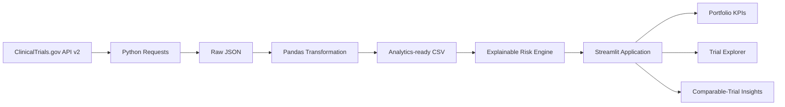

# TrialPulse Oncology

**Clinical trial intelligence and explainable monitoring analytics using public ClinicalTrials.gov data.**

TrialPulse Oncology is a weekend-scale healthcare analytics product that transforms public Phase II and Phase III oncology study records into portfolio KPIs, interactive visualizations, comparable-trial benchmarks, and transparent monitoring-priority indicators.

> **Important:** TrialPulse is an exploratory portfolio project. Its indicators are analytical heuristics and are not clinical, regulatory, operational, or investment recommendations.

## Business Problem

Clinical operations and portfolio teams oversee many studies across phases, sponsors, geographies, enrollment targets, and timelines. Raw registry records are useful but not optimized for rapid portfolio-level review. TrialPulse creates a focused analytical layer for questions such as:

- Which studies have unusually long timelines?
- Which active studies have expected completion dates in the past?
- Which trials have limited registered site coverage?
- How does a selected study compare with similar-phase oncology trials?
- Which sponsors and phases dominate the selected portfolio?

## MVP Features

- ClinicalTrials.gov API v2 extraction
- Official API version and `dataTimestamp` freshness display
- Phase II and Phase III oncology portfolio
- Executive KPI cards and interactive Plotly charts
- Sponsor, phase, status, and monitoring-priority filters
- Transparent 0–100 monitoring-priority score
- Plain-English rationale for every score
- Comparable-trial benchmarking
- Searchable trial explorer
- CSV export
- Direct links to public ClinicalTrials.gov study records

## Architecture



## Technology

- Python
- Pandas
- Requests
- Plotly
- Streamlit
- GitHub

All tools used in the MVP are free.

## Run Locally

```bash
git clone https://github.com/gauripushkark/trialpulse-clinical-trial-analytics.git
cd trialpulse-clinical-trial-analytics

python -m venv .venv
```

Activate the environment:

```bash
# Windows
.venv\Scripts\activate

# macOS/Linux
source .venv/bin/activate
```

Install dependencies and run:

```bash
pip install -r requirements.txt
python -m src.extract
python -m src.transform
streamlit run app.py
```

The Streamlit app can also retrieve and process data automatically when the processed CSV is absent.

## Monitoring-Priority Method

| Indicator | Points |
|---|---:|
| Completion date passed while study remains active | 30 |
| Planned duration above portfolio 75th percentile | 20 |
| Active duration above active-study 75th percentile | 20 |
| Fewer than three registered locations | 15 |
| Enrollment below half the portfolio median | 10 |
| Public record not updated in more than two years | 5 |

Categories:

- **Low:** 0–24
- **Moderate:** 25–49
- **High:** 50–74
- **Critical:** 75–100

The framework is deliberately explainable. It is not a trained machine-learning model and does not predict clinical success or failure.

## Repository Structure

```text
.
├── app.py
├── requirements.txt
├── src/
│   ├── api_status.py
│   ├── extract.py
│   ├── transform.py
│   ├── risk.py
│   └── insights.py
├── data/
│   ├── raw/
│   └── processed/
├── docs/
│   ├── architecture.md
│   ├── methodology.md
│   ├── data_dictionary.md
│   ├── data_model.md
│   └── limitations.md
└── assets/
    └── screenshots/
```

## Responsible Use

TrialPulse uses public study-level registry information and no patient-level data. Registry data may be incomplete, delayed, inconsistently maintained, or changed after extraction. Scores should only be interpreted as exploratory portfolio signals.

## Author

**Gauri Kulkarni**  
Business and Data Analytics | Healthcare and Life Sciences Analytics
