# TrialPulse Oncology

**Clinical trial portfolio intelligence, explainable monitoring analytics, and peer benchmarking using public ClinicalTrials.gov data.**

TrialPulse Oncology is an end-to-end healthcare analytics project that transforms public oncology clinical-trial registry data into an analytics-ready data model, interactive Power BI reporting, a Streamlit analytical application, geographic intelligence, study-level investigation, and explainable monitoring-priority indicators.

> **Important:** TrialPulse is an analytical portfolio project. Monitoring-priority indicators are transparent heuristics designed to support exploratory portfolio review. They do not predict clinical success, regulatory approval, trial failure, or sponsor performance.

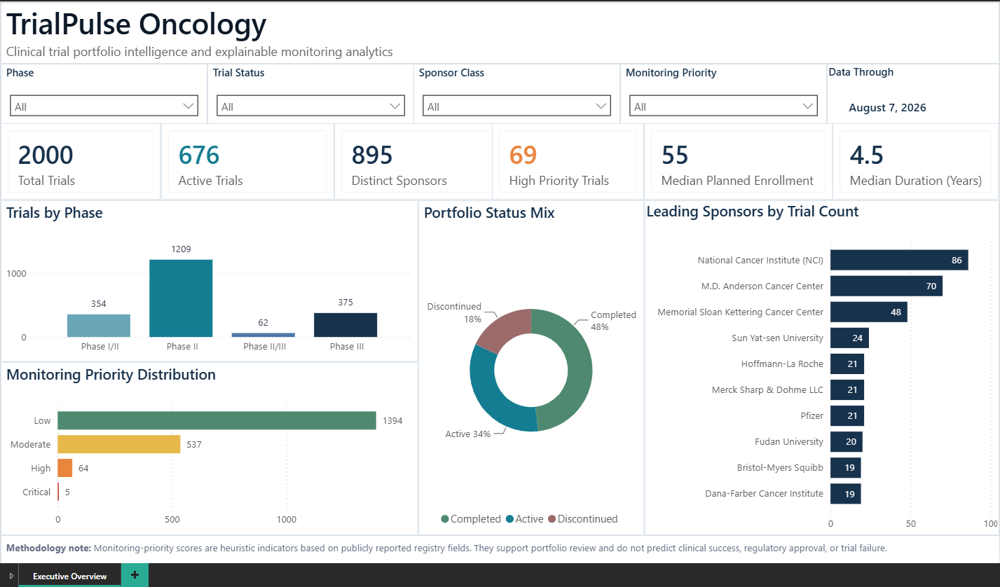

---

## Portfolio Snapshot

**ClinicalTrials.gov data through August 7, 2026**

| Metric | Verified Value |
|---|---:|
| Oncology Trials | 2,000 |
| Active Trials | 676 |
| Distinct Sponsors | 895 |
| Countries Covered | 85 |
| High/Critical Priority Trials | 69 |
| High/Critical Priority Rate | 3.5% |
| Median Planned Enrollment | 55 |
| Median Planned Duration | 4.5 years |
| Geography Coverage | 93.4% |

All headline metrics are reproduced through `src/validate_metrics.py` and documented in [`docs/verified_metrics.md`](docs/verified_metrics.md).

---

## Business Problem

Clinical operations, portfolio, and analytics teams work with large volumes of trial information spanning phases, sponsors, enrollment targets, timelines, sites, geographies, and registry updates.

Public registry data is valuable, but answering portfolio-level questions quickly often requires additional analytical modeling.

TrialPulse was designed to answer questions such as:

- Which trials warrant additional monitoring attention?
- What factors are contributing to a trial's monitoring-priority score?
- Which studies have limited registered site coverage or overdue completion dates?
- How concentrated is the portfolio across sponsors and sponsor classes?
- Which countries have the largest trial footprint?
- How does a selected study compare with trials in the same phase and status?
- Which registry records appear stale or incomplete?
- How can a reviewer move from an executive portfolio view to an individual study investigation?

---

## Solution

TrialPulse combines a reproducible Python data pipeline with two analytical experiences:

### Power BI Executive Analytics

A six-page interactive report designed for portfolio-level and study-level analysis:

1. **Executive Overview** — portfolio KPIs, phase mix, status mix, monitoring distribution, and leading sponsors.
2. **Portfolio Health** — monitoring conditions, registry freshness, duration, enrollment, and sponsor-class exposure.
3. **Sponsor Intelligence** — sponsor concentration, industry participation, and normalized monitoring exposure.
4. **Geographic Intelligence** — country coverage, geographic scope, global footprint, and country-level monitoring rates.
5. **Trial Explorer** — study-level attributes, registry timeline, monitoring rationale, clinical context, and direct ClinicalTrials.gov access.
6. **Benchmark Analysis** — selected-trial comparison against a peer cohort defined by the same Phase and Trial Status.

### Streamlit Analytical Application

A complementary Python application providing:

- Executive portfolio metrics
- Interactive Plotly analysis
- Searchable trial explorer
- Explainable monitoring rationale
- Comparable-trial context
- Direct ClinicalTrials.gov links
- Downloadable analytical data

---

## Power BI Report

### Executive Overview


### Portfolio Health & Monitoring Analysis

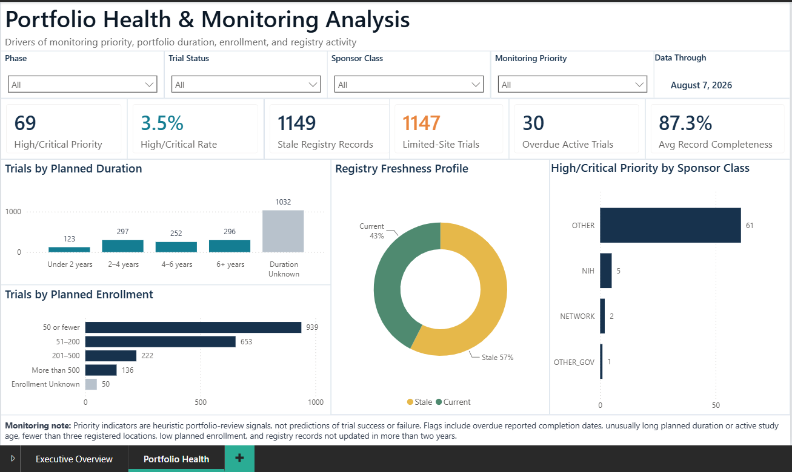

### Sponsor Intelligence

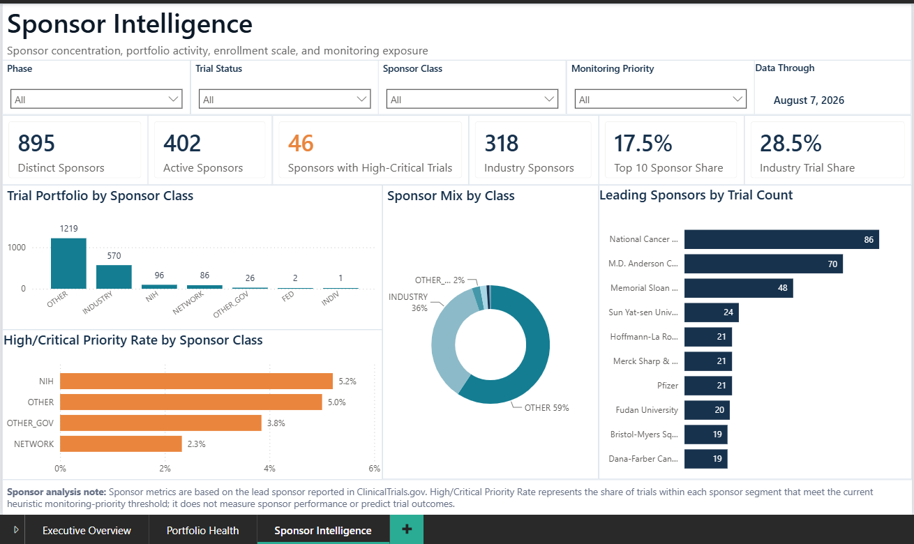

### Geographic Intelligence

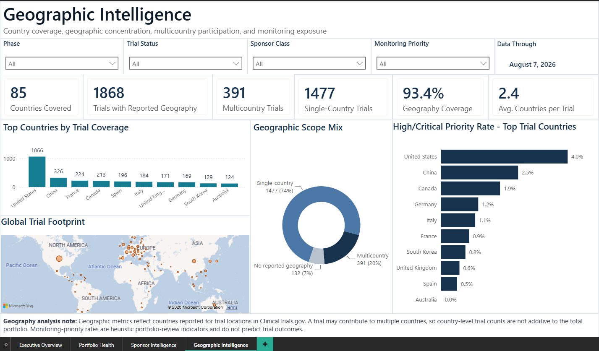

### Trial Explorer & Monitoring Detail

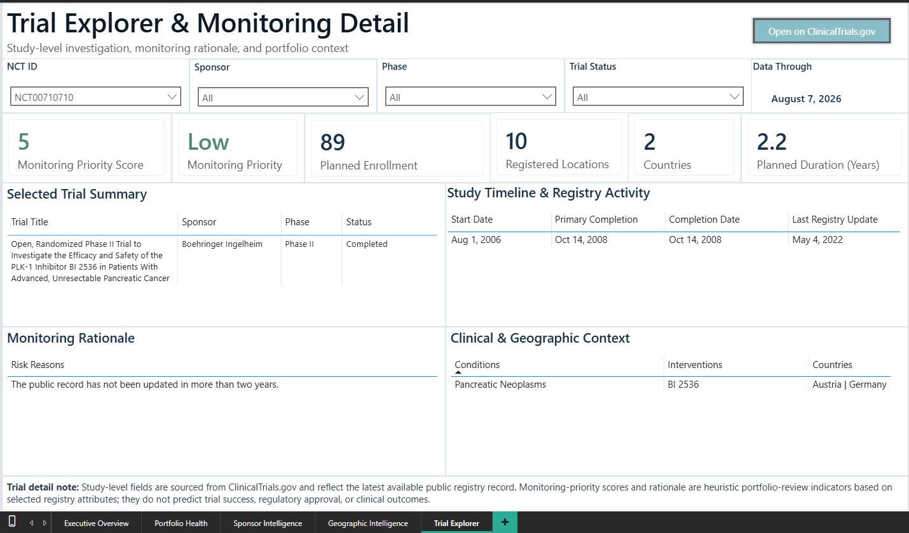

### Trial Benchmark & Peer Analysis

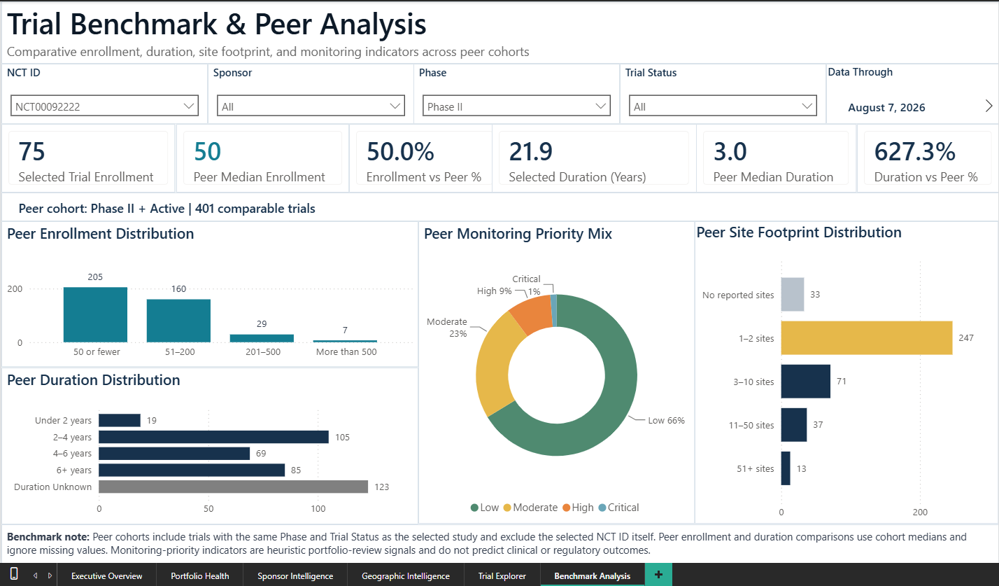

---

## Streamlit Application

### Executive Portfolio View

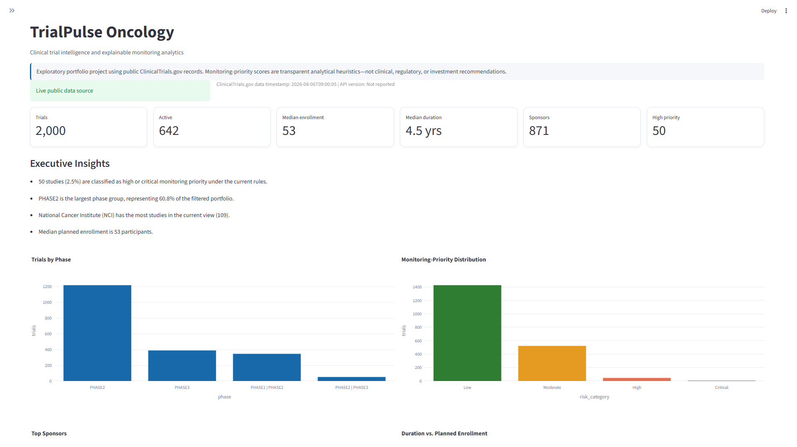

### Portfolio Analysis

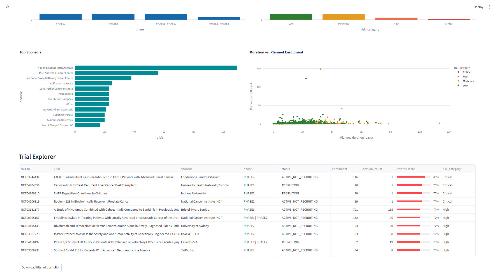

### Trial Explorer & Comparison

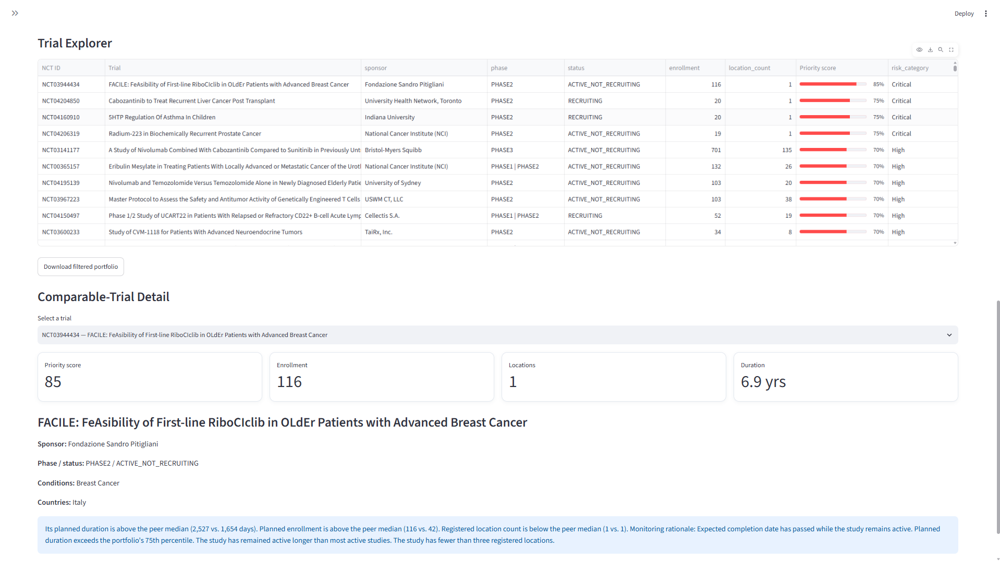

### Trial Detail

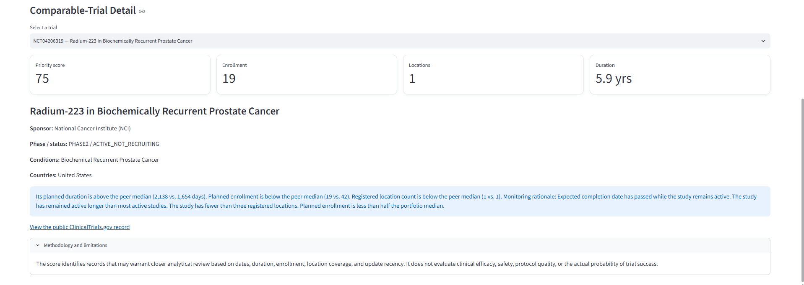

---

## Analytical Architecture

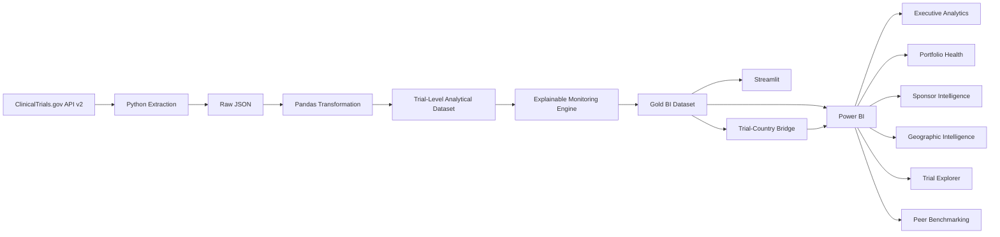

## Data Model

The primary analytical dataset contains one row per unique ClinicalTrials.gov NCT ID.

For geographic analysis, TrialPulse creates a normalized `TrialCountries` bridge table with one row per unique **trial-country combination**.

### Final geographic layer

| Metric | Value |
|---|---:|
| Trial-Country Records | 4,545 |
| Trials with Reported Geography | 1,868 |
| Countries Covered | 85 |
| Multicountry Trials | 391 |
| Single-Country Trials | 1,477 |
| Geography Coverage | 93.4% |

The Power BI model uses a one-to-many relationship:

```text
Trials[nct_id]  1 ─────▶ *  TrialCountries[nct_id]
```

This design prevents duplication of trial-level measures while supporting country-level filtering, mapping, and geographic analysis.

## Monitoring-Priority Framework

TrialPulse uses a transparent 0–100 heuristic monitoring-priority score.

| Indicator | Points |
|---|---:|
| Reported completion date passed while study remains active | 30 |
| Planned duration above portfolio 75th percentile | 20 |
| Active study age above active-study 75th percentile | 20 |
| Fewer than three registered locations | 15 |
| Planned enrollment below half the portfolio median | 10 |
| Public registry record not updated in more than two years | 5 |

### Priority Categories

| Score | Category |
|---|---|
| 0–24 | Low |
| 25–49 | Moderate |
| 50–74 | High |
| 75–100 | Critical |

Each trial retains plain-English reasons describing which rules contributed to its score.

Final portfolio distribution:

| Priority | Trials |
|---|---:|
| Low | 1,394 |
| Moderate | 537 |
| High | 64 |
| Critical | 5 |

The score is deliberately explainable. It is **not a machine-learning prediction** and does not estimate clinical success, regulatory approval, trial failure, or sponsor performance.

---

## Peer Benchmarking

The Benchmark Analysis page compares a selected trial with a dynamically constructed peer cohort.

Peers are defined as:

**same Phase + same Trial Status, excluding the selected NCT ID itself.**

Comparisons include:

- Selected enrollment vs peer median
- Selected duration vs peer median
- Enrollment distribution
- Duration distribution
- Monitoring-priority mix
- Registered-site footprint

Power BI uses disconnected analytical dimensions and DAX `TREATAS()` logic so the selected NCT ID can define the study while peer-distribution visuals continue to display the full comparable cohort.

---

## Record Completeness

TrialPulse includes a descriptive record-completeness indicator based on selected analytical fields.

| Completeness Score | Trials |
|---|---:|
| 100 | 1,032 |
| 75 | 922 |
| 50 | 46 |

**Average record completeness: 87.3%**

This metric describes whether selected analytical fields are populated. It is **not an overall assessment of ClinicalTrials.gov data accuracy, quality, or reliability**.

---

## Technology Stack

### Data Engineering & Analytics

- Python
- Pandas
- NumPy
- Requests
- ClinicalTrials.gov API v2

### Business Intelligence

- Power BI
- DAX
- Power Query
- Geographic mapping

### Application & Visualization

- Streamlit
- Plotly

### Development & Version Control

- Git
- GitHub
- VS Code

---

## Run Locally

Clone the repository:

```bash
git clone https://github.com/gauripushkark/trialpulse-clinical-trial-analytics.git
cd trialpulse-clinical-trial-analytics
```

Create a virtual environment:

```bash
python -m venv .venv
```

Activate the environment:

```bash
# Windows PowerShell
.\.venv\Scripts\Activate.ps1

# macOS/Linux
source .venv/bin/activate
```

Install dependencies:

```bash
pip install -r requirements.txt
```

### Rebuild the analytical datasets

```bash
python -m src.extract
python -m src.transform
python -m src.bi_export
python -m src.geography_export
```

### Validate portfolio metrics

```bash
python -m src.validate_metrics
```

### Launch the Streamlit application

```bash
streamlit run app.py
```

---

## Power BI File

The completed Power BI report is included in the repository:

```text
powerbi/TrialPulse_Oncology_Executive_Analytics.pbix
```

The report contains six analytical pages:

1. Executive Overview
2. Portfolio Health
3. Sponsor Intelligence
4. Geographic Intelligence
5. Trial Explorer
6. Benchmark Analysis

---

## Repository Structure

```text
.
├── app.py
├── requirements.txt
│
├── src/
│   ├── __init__.py
│   ├── api_status.py
│   ├── extract.py
│   ├── transform.py
│   ├── risk.py
│   ├── insights.py
│   ├── bi_export.py
│   ├── geography_export.py
│   └── validate_metrics.py
│
├── data/
│   ├── raw/
│   └── processed/
│       ├── trialpulse_oncology.csv
│       ├── trialpulse_gold_dataset.csv
│       └── trialpulse_trial_countries.csv
│
├── powerbi/
│   └── TrialPulse_Oncology_Executive_Analytics.pbix
│
├── docs/
│   ├── architecture.md
│   ├── methodology.md
│   ├── data_dictionary.md
│   ├── data_model.md
│   ├── limitations.md
│   ├── project_journal.md
│   └── verified_metrics.md
│
└── assets/
    ├── branding/
    ├── diagrams/
    └── screenshots/
```

---

## Reproducibility & Validation

The final analytical dataset contains **2,000 unique oncology trials**.

Headline metrics can be independently reproduced using:

```bash
python -m src.validate_metrics
```

Final validation results:

| Validation Check | Result |
|---|---:|
| Unique Trials | 2,000 |
| Duplicate NCT IDs | 0 |
| Missing Sponsor Class | 0 |
| Missing Last Update Date | 0 |
| Minimum Monitoring-Priority Score | 0 |
| Maximum Monitoring-Priority Score | 95 |

The complete validated metric reference is available in:

[`docs/verified_metrics.md`](docs/verified_metrics.md)

---

## Responsible Use & Limitations

TrialPulse uses publicly available study-level ClinicalTrials.gov registry information and contains **no patient-level data**.

Registry records may be incomplete, delayed, inconsistently maintained, or updated after extraction. Missing information does not necessarily indicate poor study conduct or poor underlying data quality.

Monitoring-priority scores are heuristic analytical signals intended to support exploratory portfolio review. They should not be interpreted as:

- predictions of clinical-trial success or failure,
- assessments of efficacy or safety,
- regulatory recommendations,
- measures of sponsor performance, or
- investment recommendations.

See [`docs/methodology.md`](docs/methodology.md) and [`docs/limitations.md`](docs/limitations.md) for additional methodological context.

---

## Author

**Gauri Kulkarni**  
Business Intelligence & Data Analytics | Healthcare & Life Sciences Analytics

---

## Project Status

**Complete end-to-end analytics portfolio project**

- Python data extraction and transformation pipeline
- ClinicalTrials.gov API v2 integration
- Explainable monitoring-priority framework
- Analytics-ready gold dataset
- Geographic bridge data model
- Reproducible metric-validation layer
- Interactive Streamlit analytics application
- Six-page Power BI executive analytics report
- Study-level investigation workflow
- Dynamic peer benchmarking
- Technical and methodological documentation