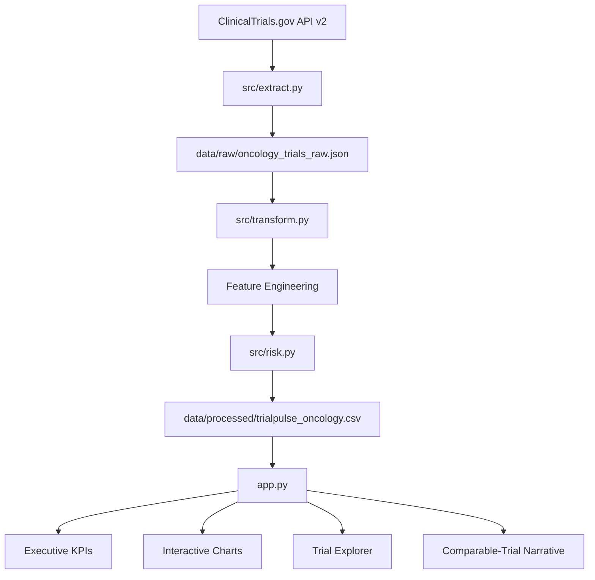

# Architecture

## Design Choices

- **API v2:** current official ClinicalTrials.gov REST interface.
- **Local analytical dataset:** stable, simple, and appropriate for a weekend portfolio MVP.
- **Rule-based scoring:** transparent and auditable; avoids unsupported claims of predictive accuracy.
- **Streamlit:** enables a free, interactive public application using a Python-only stack.
