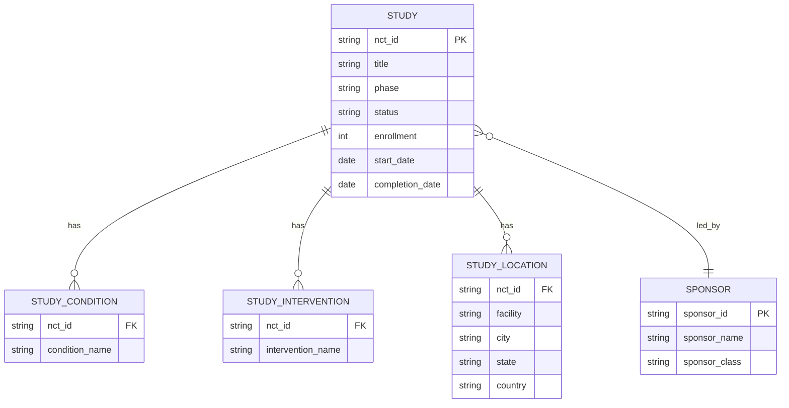

# TrialPulse Analytical Data Model

TrialPulse v1 uses a single study-grain analytical table. One row represents one ClinicalTrials.gov study.

## Grain

**One row per unique `nct_id`.**

## Source Domains

| Domain | Example source fields | Purpose |
|---|---|---|
| Identification | NCT ID, brief title, official title | Study lookup and display |
| Study design | phase, study type, enrollment | Portfolio segmentation and benchmarking |
| Status and dates | overall status, start, completion, last update | Timeline and freshness analysis |
| Sponsor | lead sponsor name and class | Sponsor portfolio analysis |
| Conditions and interventions | conditions, intervention names | Therapeutic context |
| Locations | facilities and countries | Site coverage and geographic analysis |

## Core Analytical Table

| Column | Role |
|---|---|
| `nct_id` | Primary key |
| `brief_title` | Display title |
| `official_title` | Detailed title |
| `status` | Recruitment status |
| `phase` | Trial phase |
| `sponsor` | Lead sponsor |
| `sponsor_class` | Sponsor category |
| `conditions` | Registered conditions |
| `interventions` | Registered interventions |
| `enrollment` | Planned or actual enrollment |
| `start_date` | Study start |
| `completion_date` | Study completion |
| `last_update_date` | Registry freshness |
| `location_count` | Registered site count |
| `country_count` | Distinct country count |
| `study_duration_days` | Completion minus start |
| `study_age_days` | Current date minus start |
| `risk_score` | Explainable monitoring-priority score |
| `risk_category` | Low, Moderate, High, Critical |
| `risk_reasons` | Plain-English score rationale |

## Why a Single Table for v1

A normalized multi-table model would be appropriate for a larger production system, especially where studies, interventions, conditions, and locations need independent querying. For this weekend MVP, the single study-grain table minimizes complexity while remaining transparent and suitable for Streamlit analytics.

## Future v2 Model

